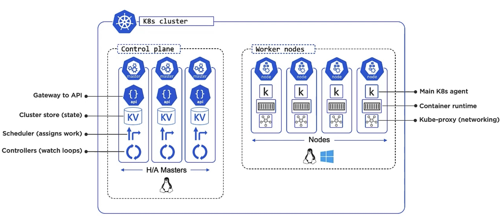

# Architecture

* Contents
  * [Big Picture View](#bigpic)
  * [Masters](#master)
  * [Nodes](#node)
  * [The Declarative Model and Desired State](#declarative)
  * [Pods](#pod)
  * [Services](#service)
  * [Deployments](#deployment)
  * [The API and API Server](#api)

- - - -

* Big Picture View<a id="bigpic"></a>
  * K8s is an orchestrator of micro services apps
  * Analogy: football team
    * players have diff skills
    * coach give every one diff roles and responsibility, to form a team
    * in conctantly changing situation, coach can replace players
    * K8s is like the coach in a footable team, organizing everything into a useful app
  * cluster, containing masters and nodes
  * masters: Control plane
  * nodes: do the work and report back to masters
  * deployment - pod - app
    * defined in YAML file
* Masters<a id="master"></a>
  * aka. head nodes, control plane
  * Multi-master high available control plane, putting them on diff failure domains
  * Number of masters
    * 3 is good, 5 is ok, too many master nodes may cause difficulties to achieve consensus
    * Even number is a bad idea, split brain -> deadlock
  * Roles
    * 1 Leader
    * Others are followers
    * Election, if leader is down
  * only Linux
  * Hosted K8s, cloud service provider run k8s masters for you. master nodes are invisible for users, and out of control. Expose highy available API endpoint
  * Don't run user apps on masters
  * Components
    * kube-apiserver
      * front-end to the control plane
      * Exposes REST API
      * JSON/YAML
    * Cluster store (KV)
      * persists cluster state and config
      * based on etcd
      * Performance is critical
      * Have recovery plans in place
    * Kube-controller-manager
      * Controller of controllers
        * Node controller
        * Deployment controller
        * Endpoints/EndpointSlice controller
      * Watch loop
      * Reconcile observed state with desired state
    * Kube-scheduler
      * Watch API Server for new work task
      * Assigns work to cluster nodes
        * Affinity关联/Anti-affinity反关联
        * Constraints
        * Taints污点
        * Resources
    * kubctl -> apiserver (authN + authZ) -> cluster store -> scheduler -> controllers (monitoring)
* Nodes<a id="node"></a>
  * Components
    * Kubelet
      * Main k8s agent, run on every node. We often use the words interchangebally, node <-> kubelet
      * Register node with cluster
      * Watch API  server for work tasks (Pods)
      * Executes Pods
      * Reports back to masters
    * Container Runtime
      * Can be Docker
      * Pluggable: CRI (Container Runtime Interface)
        * Docker, containerd, CRI-O, Kata...
      * Low-level container intelligence
    * Kube-proxy, network brain
      * Networking component
      * Pod IP addresses, 1 IP per Pod
      * Basic load-balancing
  * Virtual Kubelet: Nodeless Kubernetes
    * pods run on cloud's hosted container back-end
  * Linux, Windows
* The Declarative Model and Desired State<a id="declarative"></a>
  * Declarative Model
    * Describe what you want (desired state) in a manifest file
    * post the manifest to k8s api, then k8s takes all the work, to keep the desired state are implemented
    * For example, if client declare to have 3 instances of a web service, k8s implement and monitor them.
    * If observed state deverges from the desired state, k8s will work on that until they match
* Pods<a id="pod"></a>
  * Atomic units of scheduling/deploying
    * VM, in VM world
    * Container, in container world
    * Pod, in K8s
      * Yes, K8s orchestrate containers, but containers must always run inside of pods
  * pod is a shared execution environment
    * ip addr and network ports
    * file system
    * volume, memory
    * If you have multiple containers in 1 pod, they all share same environemnt/resources, e.g. same ip, then each container have diff port number
  * Coupling pods
    * Tightly coupled (2 or more container in 1 pod)
      * 2 container must share volumes, memory, etc.
    * Loosely coupled (containers in diff pods)
      * 2 containers don't have to share resources.
  * Scaling
    * Scale up -> add more pods, NOT add more containers in 1 pod
  * Example: Service mesh
    * Injecting a mesh container in to an application pod for providing enhanced services
  * Atomic
    * pod deployment is an atomic operation. the pod show up and running service only when all containers in it are up and running
    * containers in a pod are always schedule to a single node. They need share environment/resources
  * Mortal
    * pending -> running -> succeeded/failed
    * no such thing like coming back to live
  * Why pod over bare containers
    * annotations
    * labels
    * policies
    * resources constraints and requirements
    * co-scheduling containers
* Services<a id="service"></a>
  * Problem: Pod IPs are unreliable, when deploy new pods, scale up/down, rolling update
  * Service has stable DNS name and ip, load balancing to app pods
  * Labels
    * simple, powerful, flexible
    * Service use labels to find the pods and include into the load balancing group
    * For example, 
      1. pods A and B have lables: "prod", "be", "1.3"
      2. the service has the same labels: "prod", "be", "1.3", Then they are connected, service will distribute requests to A and B
      3. Now, we want update to version 1.4
      4. One way is, start 2 new pods, C and D, with label "1.4"
      5. Remove the "1.3" label on service. Then service is load balancing across all 4 pods (blue grenn deployment).
      6. If we are confident about 1.4 version, we can add the "1.4" label to service, then service will only link to new pods C and D with "1.4".
  * Features:
    * Services only send traffic to healthy pods
    * Can do session affinity
    * can send traffic to endpoints outside the cluster
    * can do TCP(default) and UDP
* Deployments<a id="deployment"></a>
  * Features
    * Scaling
    * Self-healing
    * Zero downtime
    * Rolling updates
  * Deployment Controller/Reconciliation loop
    * Watch API Server for new Deployments
    * Implements them
    * Constantly compares observed state with desired state
  * Deploy: manages updates, rollbacks
    * Replica set: Replica count, self-healing, previous versions
      * Pod: labels, annotations, co-scheduling...
        * App runing in container
  * Sample YAML, from <https://github.com/nigelpoulton/getting-started-k8s/blob/master/Deployments/deploy.yml>
    ```yaml
    apiVersion: apps/v1
    kind: Deployment
    metadata:
    name: web-deploy
    labels:
        app: web
    spec:
    replicas: 5
    selector:
        matchLabels:
        app: web
    template:
        metadata:
        labels:
            app: web
        spec: 
        terminationGracePeriodSeconds: 1
        containers:
        - name: hello-pod
            image: nigelpoulton/getting-started-k8s:1.0
            imagePullPolicy: Always
            ports:
            - containerPort: 8080
    ```
* The API and API Server<a id="api"></a>
  * Every components we talked is an object in K8s API
  * API is like a catalog, contains the definition and feature set of every components in K8s
  * API server expose the APIs as REST service over HTTPS

- - - -

Recap


